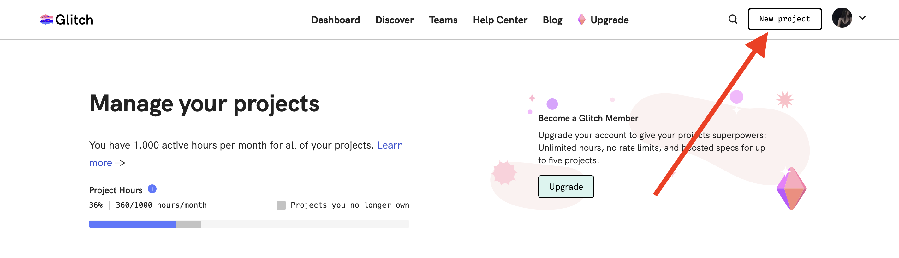
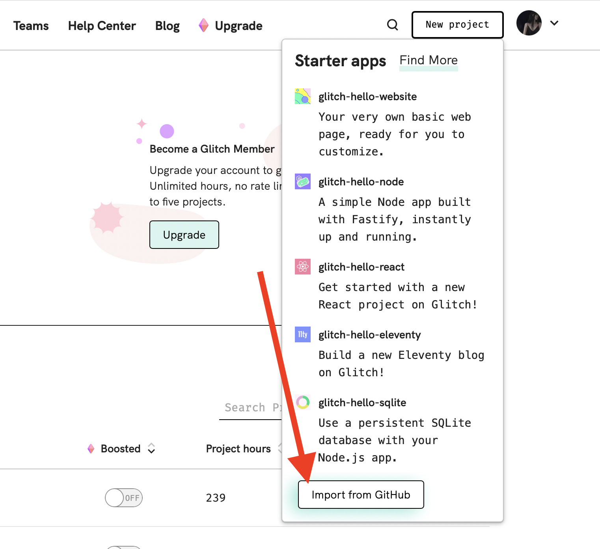
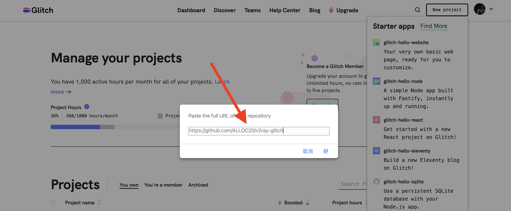
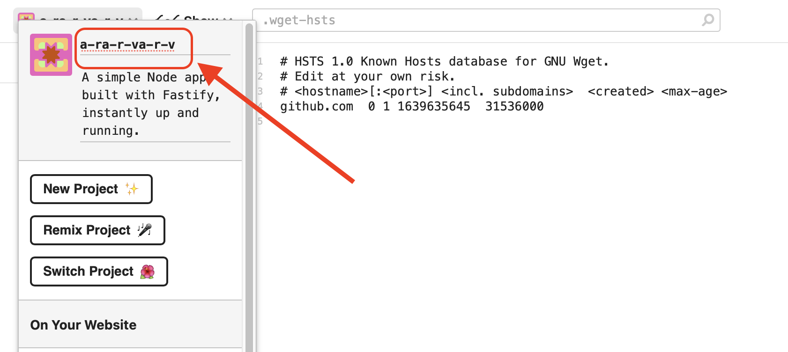

# v2ray-glitch

在Glitch中部署v2ray服务

请勿重度使用！！！

官网: https://glitch.com/

部署步骤: New Project -> Import form Github -> 将本项目网址粘贴进去 "https://github.com/ALLOC20/v2ray-glitch"

1. New Project

2. Import form Github

3. 粘贴本项目网址

必要调整: 改应用名称 -> 生成UUID并填入代码中 -> 是否保持唤醒 -> 刷新

1.改应用名称

2.生成UUID并填入代码中

前往地址: "https://www.uuidgenerator.net", 生成一个UUID

3.是否保持唤醒

4.刷新

# Deploy to Glitch  

Official: https://glitch.com/  

How to Install: New Project -> Import form Github -> paste "https://github.com/qkqpttgf/OneManager-php", after done, Show -> In a New Window.  
